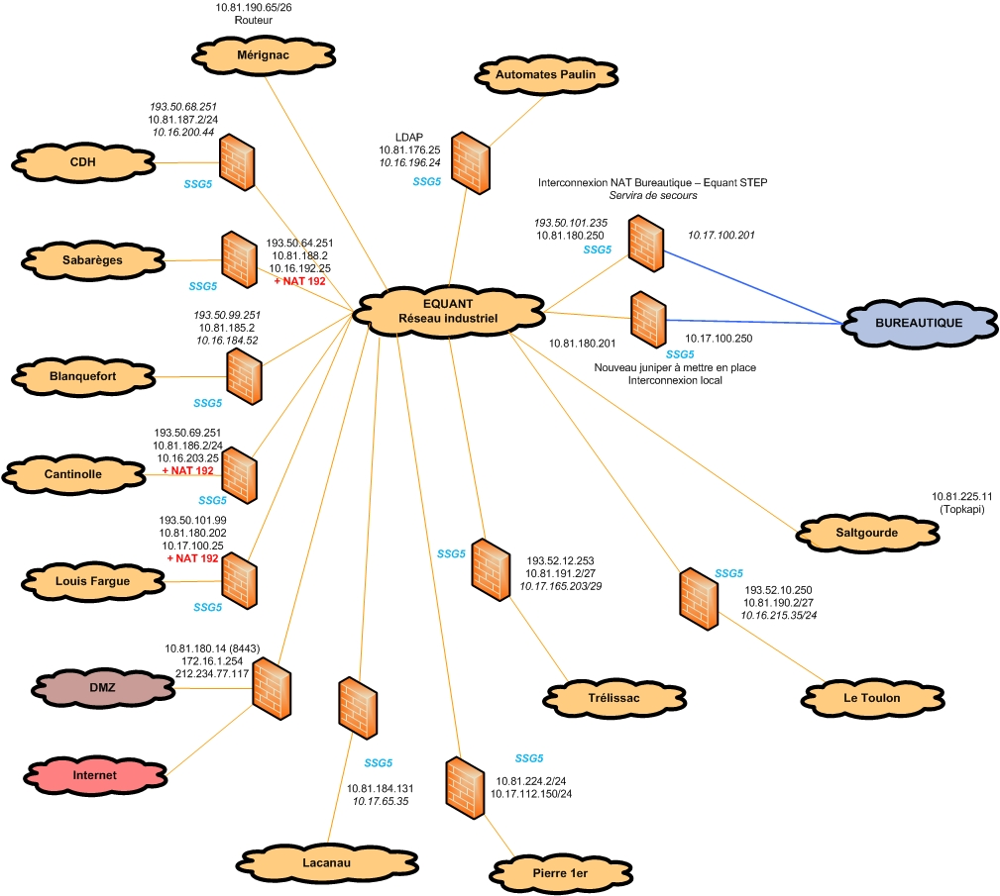
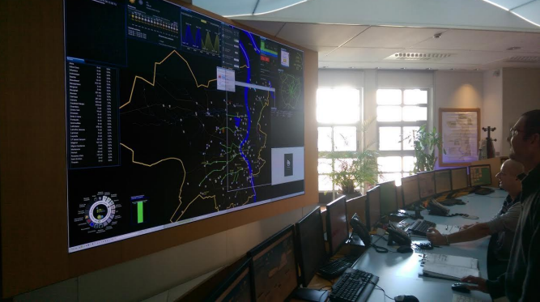

# Description et présentation des activités et du fonctionnement de SUEZ - SGAC

## L'entreprise

### Mission

**L**a SGAC, Société de Gestion de l’assainissement de Bordeaux Métropole, est l’acteur à qui la communauté d’agglomération a confié la gestion déléguée du service de l’assainissement. 
En effet par mécanisme d'appel d'offre, la communauté urbaine de Bordeaux confie à des sociétés privées la gestion de son réseau dédié à son assainissement et ce pour une durée de 6 ans. Elle est, dans ce cadre confrontée, entre autres à la concurrence de Véolia ainsi que de la SAUR. 

La société sélectionnée est chargée d'administrer les installations développée et mises en place par Bordeaux Métropole. Il apparait donc que la SGAC se trouve dans l'obligation de travailler en étroite collaboration avec les pouvoirs publics, tout en observant les consignes émises au niveau national par le groupe SUEZ. 

L'efficacité de la SGAC est indispensable au bon fonctionnement de la vie de la communauté Bordelaise, en effet, l'assainissement des eaux usées est primordial non seulement vis à vis de la population (et ce pour des raisons sanitaires évidentes) mais est également excessivement importante en vue du respect de l'environnement. Il ne serait pas responsable de rejetter l'eau sale, polluée par les activités humaines, dans la Garonne.

### Organisation structurelle

**L**a SGAC une filiale de la Lyonnaise des Eaux, nom de société qui disparait aujourd'hui au profit du nom commercial "SUEZ". En effet, historiquement, la CUB (l’ancien nom de Bordeaux-Métropole) avait confié la gestion des services de l’Eau potable et de l’Assainissement  à cette société du groupe Suez. En 2013, la communauté décidait de revoir sa structure : plusieurs délégations furent mises en place. La Gestion du service public de l'eau potable fut confiée à la Lyonnaise des Eaux, la gestion du service public de l'assainissement collectif des eaux usées et des eaux pluviales revint à une nouvelle filiale de la Lyonnaise, la SGAC, dans le cadre d'une délégation de six ans.  
Le service informatique de la SGAC couvre plusieurs zones sur Bordeaux (Louis Fargue, Pierre Ier, Paulin) ainsi que différentes communes girondines (Blanquefort, Lacanau, Mérignac…) Il assure le fonctionnement des réseaux et des serveurs pour les différentes activités de la société : réseau industriel, bureautique.

Suite à divers remaniements internes, les appellations Lyonnaises des eaux et SGAC tendent à être mis en arrière plan, à mesure que SUEZ intègre l'ensemble de ses filiales dans une optique de centralisation croissante.

## Le service informatique et sa capacité décisionnelle

### L'organisation du service informatique 

**L**a SGAC possède son propre service informatique, découpé en deux sections. La première est dévolue à l’informatique industrielle. De nombreux serveurs ont à leur charge un très grand nombre d’outils de contrôle des stations d’épuration, de pompage, ainsi que des bassins d’étalement. C’est aussi là que sont paramétrés et testés différents automates et applications.  

La seconde section concerne la bureautique.  Les équipes du service interviennent sur le vaste réseau informatique de la SGAC. Il s’agit de surveiller, gérer et assurer la maintenance du réseau, des différents serveurs, intervenir sur les postes utilisateurs ainsi que de répondre aux besoins des salariés en terme de solutions logicielles (installation de produits existants et développement de systèmes internes). Chaque réseau est protégé par un pare-feu. Une DMZ est en place et héberge notamment le serveur intranet (qui présente certaines informations devant être accessibles depuis l'extérieur du réseau, on parle aussi d'extranet).  

Deux réseaux principaux sont utilisés : le réseau industriel nommé « Equant » et le réseau « Bureautique ». Les serveurs sont répartis sur trois principaux sites : les bâtiments cours Louis Fargue, ceux de la rue Paulin et les locaux de Pierre Ier.  

### Le réseau Bureautique

**L**e réseau bureautique met en relation les différents postes utilisateurs et permet à ses dernier l'accès au serveur intranet ainsi qu'à l'ensemble de ses applications. On notera également l'existance d'un réseau téléphonique de type VoIP, profitant du réseau. 

#### L'intranet et applications associées

**L**e serveur intranet, au coeur de ma mission durant le stage, est hébergé sur une machine virtuelle.   
Il regroupe un serveur IIS, permettant de répondre aux requètes HTTP (et HTTPS) ainsi qu'un serveur SQL Server, permettant l'accès à différentes bases de données. On notera également l'existence de différents logiciels chargés de gérer de manière automatique la synchronisation de données entre les bases de données nationales et locales. 

L'intranet est articulé de la manière suivante:

Un portail Web permet d'accéder à un ensemble d'application web permettant une transmission rapide et facile des données à travers les services.
Ces applications sont fortements inter-dépendantes et ce à deux niveau. On remarque en effet, en examinant le code que certaines bibliothèques (présentant des élements d'interface utilisateurs, des accès à certaines ressources) , associée à une application en particulier sont également appelées par d'autres applications. D'autre part, la plupart de ces applications web proposent ou font appel à des webservices, interfaces permettant aux logiciels .NET de transmettre des données simplement. 
Cette architecture globale présente de nombreux avantages ainsi que quelques inconvénients, mais nous y reviendrons plus tard. 

A ces applications web s'ajoutent un certain nombre de logiciels de type client lourd, permettant pour l'essentiel une administration facile et rapide de la part du service informatique (gestion des droits etc...). Néanmoins, on remarque également l'existence d'un client lourd métiers permetant aux différents services de gagner en productivité. 

Le réseau Bureautique est relié au réseau industriel par l'intermédiaire de firewalls (un principal et un auxilliaire, utilisé en cas de secours) permettant à tout les postes utilisateurs d'atteindre l'intranet, lui-même sécurisées par un Pare-Feu, administré au niveau national. 

#### La Bureautique dans le cadre d'une gestion nationale

**I**l est en effet intéressant de relever que le réseau Bureautique est intégré à l'architecture nationale de SUEZ. De fait, l'équipe du service Bureautique perd de sa capacité d'action à deux niveaux: 

* Au niveau décisionnel, la plupart des choix relatifs au réseau sont effectué par la direction nationale de la société 
* Au niveau opérationnel, la perte du pouvoir de décision ayant entrainé une révision des droits d'administration du système, le service se retrouve dans l'incapacité d'agir dans certains cas et doit attendre la réaction du service informatique national. Causant ainsi une perte de réactivité.

### L'informatique industrielle

**L**’ampleur du réseau d’assainissement de la métropole nécessite des outils à la pointe pour une surveillance accrue. Bordeaux est une zone sensible dans le sens où le risque d’inondation (territoire en cuvette) n’est pas négligeable. Bordeaux Métropole a mis en œuvre un très important programme de lutte contre ce phénomène avec la réalisation d’ouvrages spécifiques parmi lesquels:  

* 44 bassins d'étalement et de rétention (d’une capacité totale de 2 150 000 m3) 
* 49 postes de relèvement et stations de pompage - 1980 km de canalisations pour la collecte 
*  Des "solutions compensatoires" d’assainissement pluvial sur près de 450 sites grâce à des techniques permettant de différer l’évacuation des eaux de pluie en les stockant localement, grâce à l’utilisation de matériaux poreux.   

L’ensemble de ces structures est gérée en grande partie par un vaste réseau informatique nommé « Equant ».

#### RAMSES

**P**armi les points essentiels dont le service informatique a la charge, évoquons le télécontrôle RAMSES (pour Régulation de l’Assainissement par Mesures et Supervision des Équipements et Stations).  Cet outil est l’un des rares du genre à exister sur le plan mondial. C’est réellement le centre névralgique de la surveillance du système d’assainissement de Bordeaux-Métropole. Mis en service en 1992, RAMSES  permet de surveiller 24h/24 les installations dédiées au service de l’assainissement, et de piloter en temps réel leur régulation pour assurer un écoulement optimal des flux hydrauliques.  Il constitue l’élément essentiel de la lutte contre les inondations de l’agglomération bordelaise en raison notamment, de sa capacité à anticiper les crises. En effet, RAMSES est un supercalculateur axé sur une gestion dynamique des événements. Il est capable de mettre en place différents scénarios de gestion de crise.  

L’outil principal est un immense mur d’images permettant aux techniciens de surveiller l’état du réseau et des usines mais aussi de surveiller la météo à l'aide d'une connexion en temps réel avec le radar de Météo France. Ainsi, RAMSES est capable d’afficher l'arrivée de dépressions chargées en pluie. Un réseau de capteurs au sol constitué de pluviomètres permet de suivre l'évolution des précipitations, de moduler la défense par rapport à l'intensité réelle de la menace. D’autres informations remontent également : l’état des stations de pompage, le niveau des bassins d’étalement, la situation des six stations d’épuration… Une série de moniteurs permettent enfin aux techniciens de surveiller les niveaux d’eau et d’afficher nombre de données essentielles à la surveillance du territoire intercommunal. Toute l’activité, durant les périodes d’astreinte, est pilotée par le télécontrôleur 24h sur 24.  

Pour gérer un tel outil, pour permettre également aux différents départements de la société de fonctionner (bureautique, développement, informatique industrielle) de nombreux serveurs sont en place en différents lieux de l’agglomération. Une quarantaine de serveurs physiques assurent le fonctionnement, et hébergent un total d’environ une centaine de VM (Machines virtuelles) afin d’exploiter au mieux les ressources de ces équipements, et d'isoler les différents services (Un service par machine virtuelle, ainsi en cas de panne de la machine virtuelle, un seul logiciel sera atteint).   
  

**M**aintenant que le cadre de l'entreprise est posé, nous allons nous intéresser à la description du stage en lui-même. Quels furent les objectifs à atteindre ? Comment ? Avec quels Outils ? 

